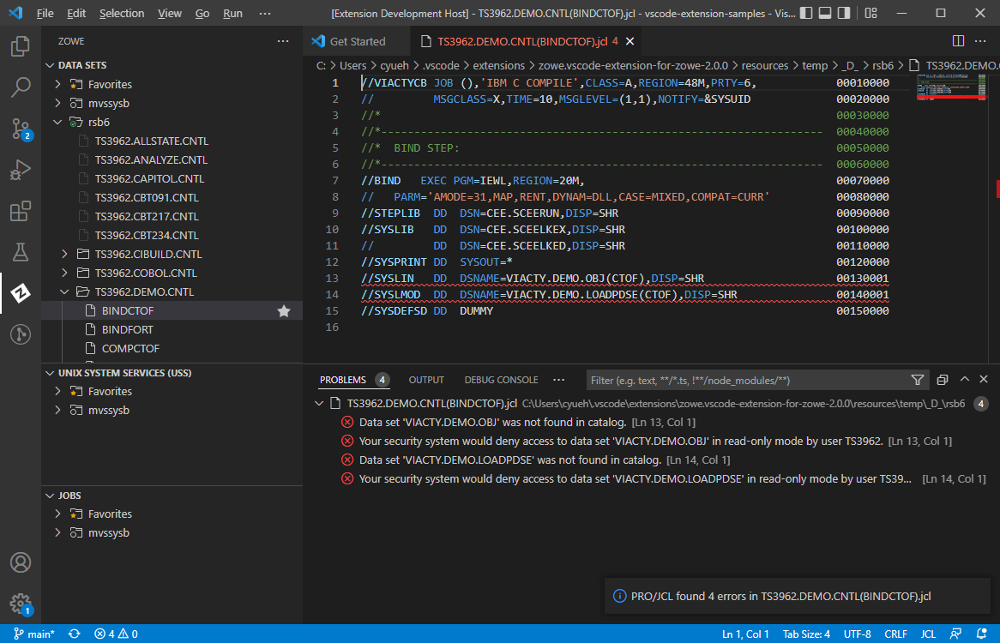

# PRO/JCL for JCL Management

PRO/JCL is a comprehensive Job Control Language (JCL) management tool that provides JCL validation, standards enforcement, and reformatting. It is designed to help developers streamline their JCL workflows on the z/OS mainframe. This extension allows you to access the most important features of PRO/JCL from your Visual Studio Code IDE.

## Features

PRO/JCL for VS Code Offers a modern and easy-to-use user interface (UI) to interact with PRO/JCL on your z/OS system. Through this extension, you can:

* Evaluate JCLs for any syntax errors.
* Enforce site-specific JCL standards.
* Provide effective reporting facility.
* Leverage RESTful web services API to automate PRO/JCL scans in a DevOps toolchain.
* (Upcoming Release) Submit jobs to the mainframe for execution.
* (Upcoming Release) Validate JCLs on remote machine.
* (Upcoming Release) Validate multiple JCLs, in user-defined order if specified.
* (Upcoming Release) Validate input data for popular JCL utility programs.
* (Upcoming Release) Restructure JCL into a standard and easy-to-read format.

With PRO/JCL for VS Code, errors in JCL are clearly described in **PROBLEMS View** and summarized in an informational message, as shown below. The source lines associated with these errors are underlined with a wavy line, in colors that identify their severity. Hovering over one of these lines displays the errors on that line. The relative positions of these errors in the source file are displayed as color dots in the right margin, allowing easy navigation to these errors.

## Requirements

The following are the minimum requirements for **PRO/JCL for VS Code**:

* **Zowe Explorer VS Code Extension**: This extension provides the user interface and services required to authenticate & access resources on the mainframe. Search for **Zowe Explorer** in Marketplace to find out more about this extension and install it.
* A valid user ID and credential for accessing mainframe resources & services using **Zowe Explorer** in VS Code.
* **PRO/JCL 3.6.0** or higher version must be installed in the z/OS system. See ***PRO/JCL Installation*** for information on installing PRO/JCL for z/OS.
* The latest monthly cumulative service for PRO/JCL must be applied.
* **IBM Liberty Profile Server for z/OS** must be installed & configured to enable PRO/JCL REST Services. See ***Building a Liberty Profile server for ASG-PRO/JCL REST Services*** for details on installing & configuring the Liberty Profile server.
* **PRO/JCL REST Services** must be installed & operational in the IBM Liberty server. See ***ASG-PRO/JCL® REST Services Quick Start Guide*** for instructions on installing & deploying the PRO/JCL REST Services.

In addition, the following extensions are ideal companions to the features in **PRO/JCL for VS Code**:

* **IBM Z Open Editor**: This extension provides language-sensitive highlighting for JCL files, perfectly complementing the syntax checking & standards validation capabilities in PRO/JCL.

## Configuration Settings

The following configuration properties are available:

* `projcl-vscode.displayOptionsBeforeScan`: Display options to use before PRO/JCL scan commands

The setting is accessible from the user interface by clicking the gear icon (Manage) in the lower left and selecting Settings, or by pressing **Ctrl+,** (**Ctrl** and **comma** keys pressed at the same time), followed by entering **PRO/JCL** in the **Search settings** input box.

## Known Issues

Be the first! As this is the first release of PRO/JCL for VS Code, there are no reported issues from outside of the development team. You can win the bragging right as the first user to find a non-trivial issue and report to PRO/JCL's support team. All types of issues are welcome, from outright internal errors to future enhancement ideas. All suggestions are considered as proprietary to Rocket Software and will be acknowledged, with permission, in future release notes when adopted.

## Release Notes

### 0.0.1

Initial release of PRO/JCL for VS Code, as part of PRO/JCL 3.6.1 release. See **Features** above for a list of features.
