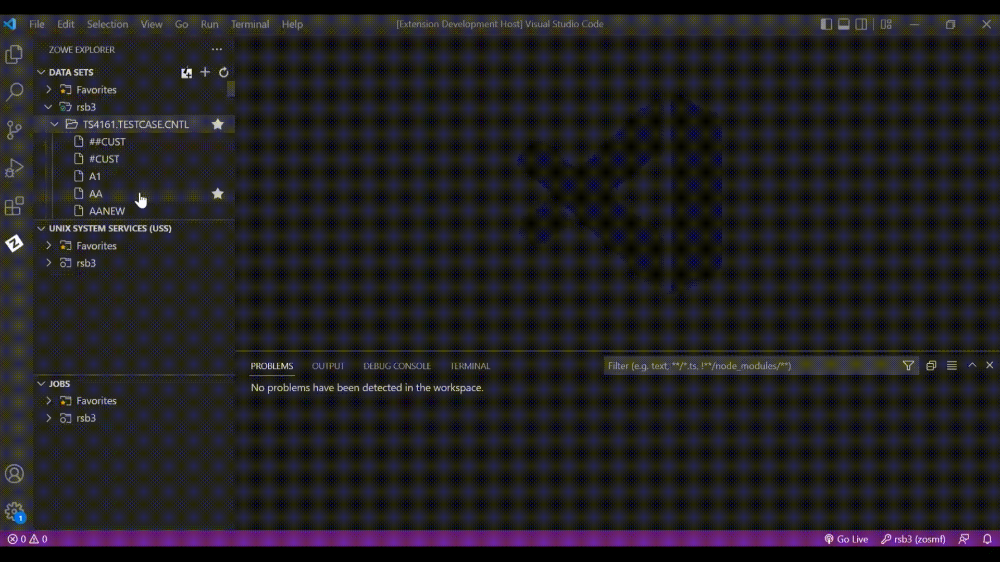

# PRO/JCL for JCL Management

PRO/JCL is a comprehensive Job Control Language (JCL) management tool that provides JCL validation, standards enforcement, and reformatting. It is designed to help developers streamline their JCL workflows on the z/OS mainframe. This extension allows you to access the most important features of PRO/JCL from your Visual Studio Code IDE.

## Features

PRO/JCL for VS Code offers a modern and easy-to-use user interface (UI) to interact with PRO/JCL on your z/OS system. Through this extension, you can:

* Evaluate JCLs for syntax errors.
* Enforce site-specific JCL standards.
* Provide an effective reporting facility.
* Leverage RESTful web services API to automate PRO/JCL scans in a DevOps toolchain.
* Submit jobs to the mainframe for execution.
* Validate input data for popular JCL utility programs.
* Restructure JCL into a standard and easy-to-read format.
* (Upcoming Release) Validate JCLs on remote machine.
* (Upcoming Release) Validate multiple JCLs, in user-defined order if specified.

With PRO/JCL for VS Code, errors in JCL are clearly described in **PROBLEMS View** and summarized in an informational message, as shown below. The source lines associated with these errors are underlined with a wavy line, in colors that identify their severity. Hovering over one of these lines displays the errors on that line. The relative positions of these errors in the source file are displayed as color dots in the right margin, allowing easy navigation to these errors.

## Requirements

The following are the minimum requirements for **PRO/JCL for VS Code**:

* **Zowe Explorer VS Code Extension**: This extension provides the user interface and services required to authenticate & access resources (datasets and jobs) on the mainframe using PRO/JCL extension. Search for **Zowe Explorer** in Marketplace to find out more about this extension and install it.
* **Connection Profile Using zosmf**: The **Zowe Explorer** must be able to connect to the mainframe using a connection profile of the type **zosmf**. This implies a z/OSMF server must be running on the mainframe and accepting REST API requests.
* A valid user ID and credential for accessing mainframe resources & services using **Zowe Explorer** in VS Code.
* **PRO/JCL 3.6.1** or higher version must be installed in the z/OS system. See [PRO/JCL Installation](https://docs.rocketsoftware.com/bundle/uyk1658142647025/page/cpn1644077472909.html) for information on installing PRO/JCL for z/OS.
* The latest monthly cumulative service for PRO/JCL must be applied.
* **IBM Liberty Profile Server for z/OS** must be installed & configured to enable PRO/JCL REST Services. See [Building a Liberty Profile server for ASG-PRO/JCL REST Services](https://docs.rocketsoftware.com/bundle/uyk1658142647025/page/ggy1660717412627.html) for details on installing & configuring the Liberty Profile server.
* **PRO/JCL REST Services** must be installed & operational in the IBM Liberty server. See [ASG-PRO/JCL® REST Services Quick Start Guide](https://docs.rocketsoftware.com/bundle/uyk1658142647025/page/xwh1660717381691.html) for instructions on installing & deploying the PRO/JCL REST Services.

In addition, the following extensions are ideal companions to the features in **PRO/JCL for VS Code**:

* **IBM Z Open Editor**: This extension provides language-sensitive highlighting for JCL files, perfectly complementing the syntax checking & standards validation capabilities in PRO/JCL.

## Configuration Settings

The following configuration properties are available:

* `projcl-vscode.displayOptions`: Display options to use before PRO/JCL operations
* `projcl-vscode.saveListings`: Save Structured JCL Listing from PRO/JCL operations
* `projcl-vscode.saveListingsIntoLocation`: Default location is .projcl/JclListings folder in user’s home directory
* `projcl-vscode.validateBeforeReformattingJCL`: Validate JCL before Reformatting

The setting is accessible from the user interface by clicking the gear icon (Manage) in the lower left and selecting Settings, or by pressing **Ctrl+,** (**Ctrl** and **comma** keys pressed at the same time), followed by entering **PRO/JCL** in the **Search settings** input box.

## Documentation

For full documentation, visit the [Rocket Software PRO/JCL documentation](https://docs.rocketsoftware.com/bundle/uyk1658142647025/page/jde1658146122791.html) site.

## Known Issues

Win the bragging right as one of the first users to find a non-trivial issue and report to PRO/JCL's support team. All types of issues are welcome, from outright internal errors to future enhancement ideas. All suggestions are considered as proprietary to Rocket Software and will be acknowledged, with permission, in future release notes when adopted.

## Technical Assistance and Support

The PRO/JCL extension is made available to customers on the Visual Studio Code Marketplace. If you are on active support for PRO/JCL, you can get technical assistance and support from ASG/Rocket Customer support team using [Support](https://www.asg.com/en/Support/Access-Login.aspx).

Note: The PRO/JCL extension uses the Output view to report its internal issues & errors. To view the messages specific to the PRO/JCL extension and not related to Zowe Explorer, click the dropdown in the Output view and select PRO/JCL.

Kindly report any issue encountered in the extension to ASG/Rocket Customer support team.

## Release Notes

### 1.0.6

* Enhanced logging to aid field diagnostics
* Updates to product logos to reflect new branding for Rocket Software

### 1.0.2

* Support reformatting of JCL using rules defined in PRO/JCL for z/OS
* Validation of input data for common JCL utility programs

### 1.0.1

* Ensure PRO/JCL Extension meets or exceeds the criteria for **Zowe V2 Conformance - Zowe Explorer for Visual Studio Code Zowe**.

### 0.6.1

* Add Options in Effect in listing if Include Summary is selected in scan profile
* Save Structured JCL Listing in user specified location

### 0.6.0

* Support scanning of JCL from the local file system, e.g., Windows
* Submit JCL for execution after successful validation
* Use credential from Zowe Explorer for PRO/JCL connection to z/OS

### 0.5.0

Initial release of PRO/JCL for VS Code, as part of PRO/JCL 3.6.1 release. See **Features** above for a list of features.
